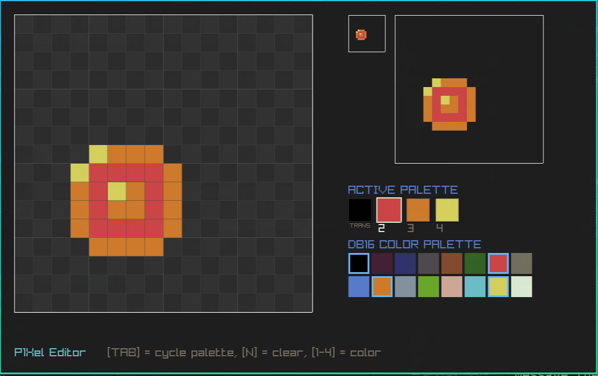

# P1Xel Editor

```
_ \   _ | \ \  /        |      ____|      | _)  |                
|   |   |  \  /    _ \  |      __|     _` |  |  __|   _ \     __| 
___/    |     \    __/  |      |      (   |  |  |    (   |   |    
_|     _|  _/\_\ \___| _|     _____| \__,_| _| \__|  \___/  _|    
```

pre-alpha



```
zig build run
zig build -Doptimize=ReleaseSmall upx
zig build -Dtarget=x86_64-windows -Doptimize=ReleaseSmall
```
