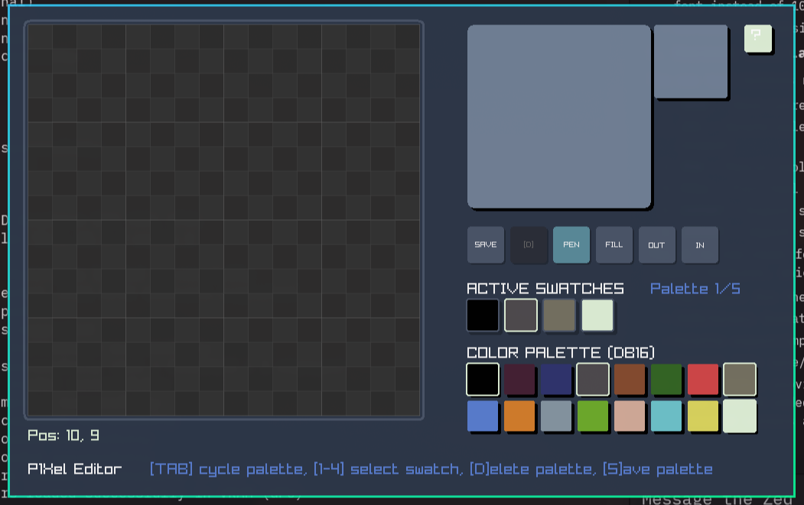
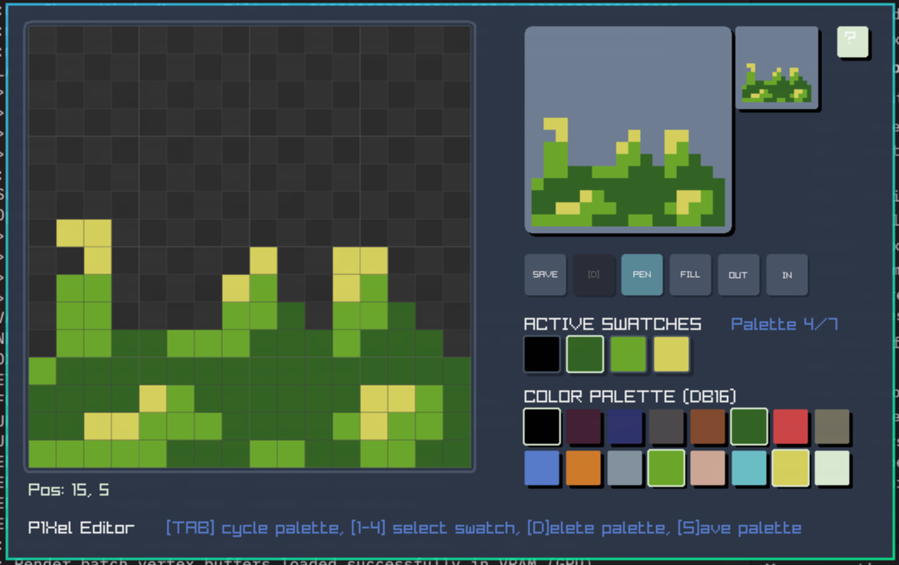
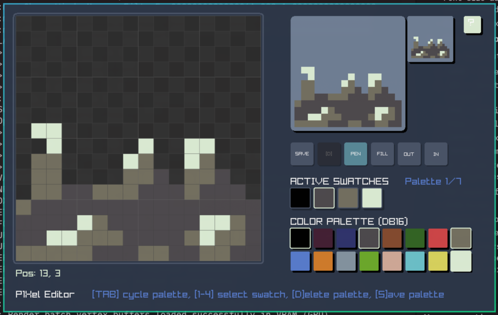
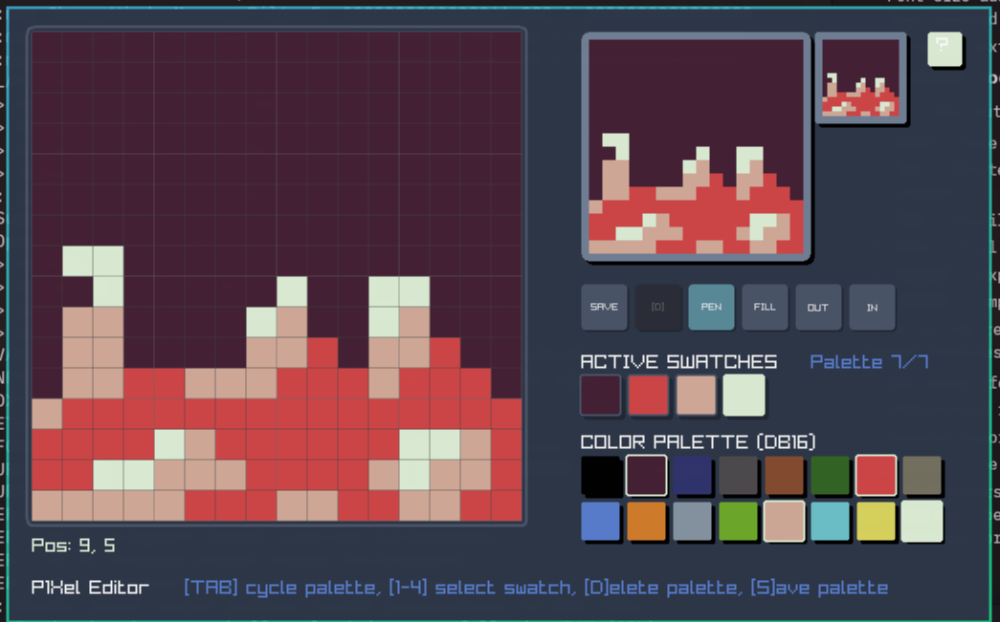

# P1Xel Editor

```
_ \   _ | \ \  /        |      ____|      | _)  |                
|   |   |  \  /    _ \  |      __|     _` |  |  __|   _ \     __| 
___/    |     \    __/  |      |      (   |  |  |    (   |   |    
_|     _|  _/\_\ \___| _|     _____| \__,_| _| \__|  \___/  _|    
```

## About
Sprite editor for my MS-DOS game. Made in Zig and Raylib.

pre-alpha



## Run
```
zig build run
```

## Build Small Binary

Host Linux -> Linux.
```
zig build \
  -Doptimize=ReleaseSmall \
  upx
```

Host Linux -> Windows
``` 
zig build \
  -Dtarget=x86_64-windows \
  -Doptimize=ReleaseSmall \
  upx
```

## Usage


### Palette Switching



