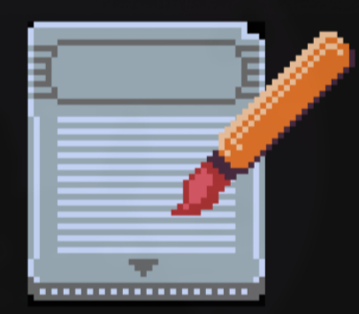
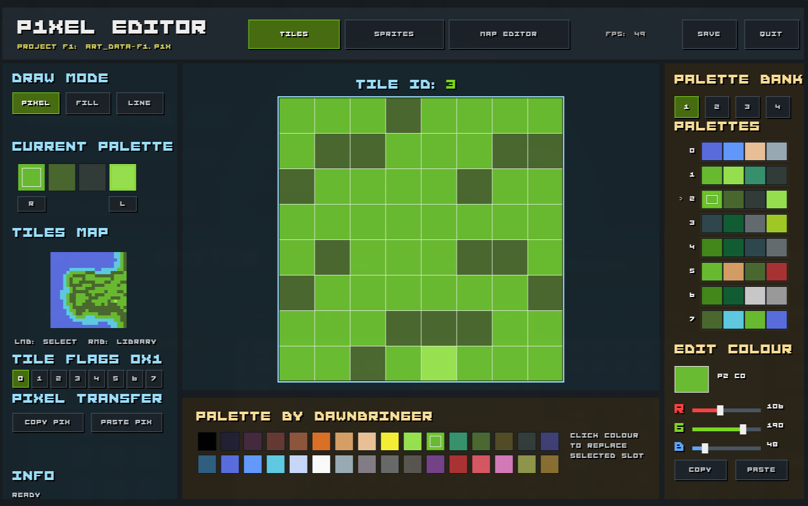
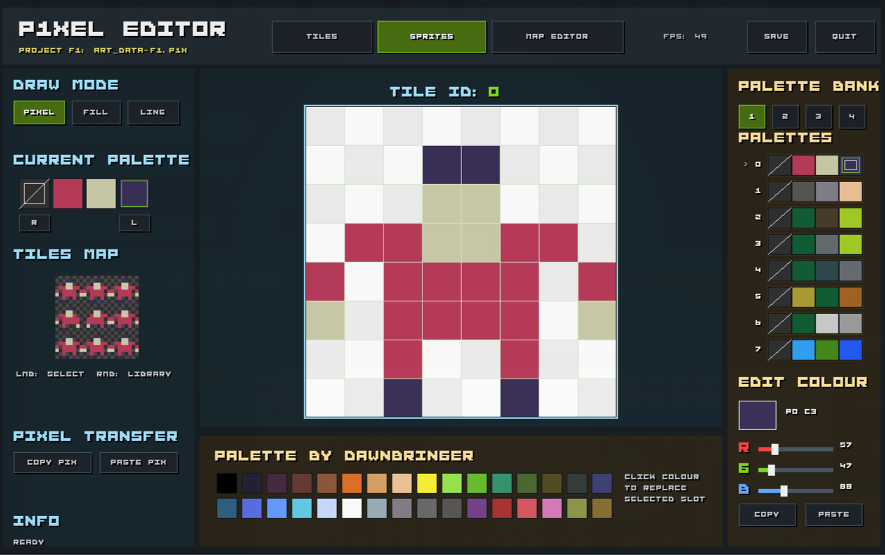
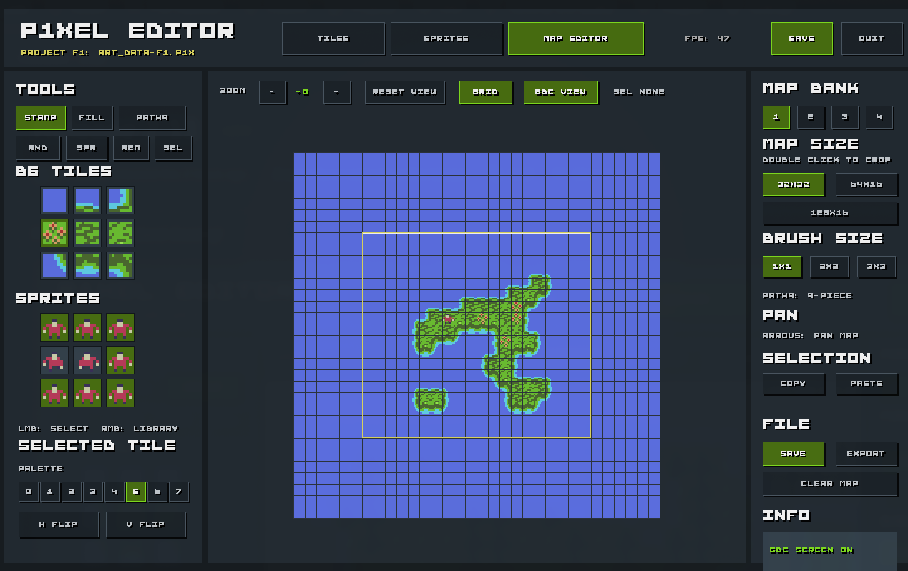
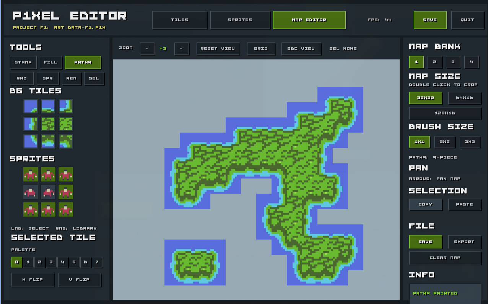
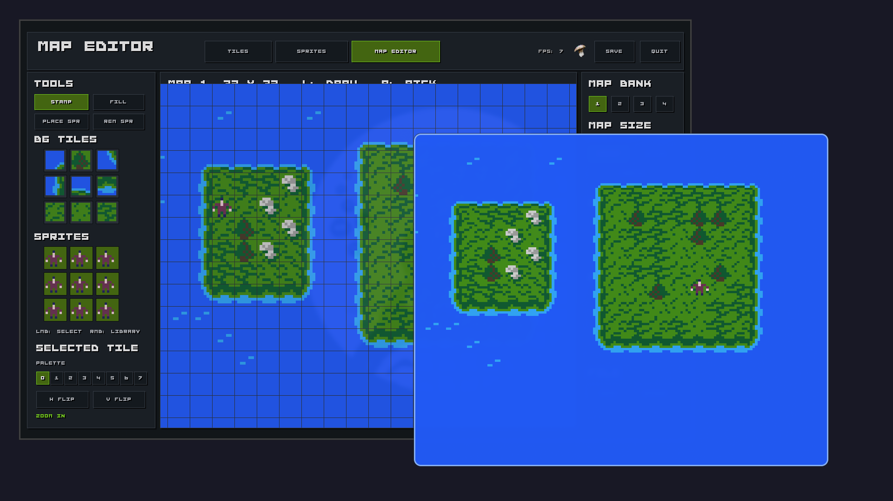

# P1Xel Editor



**P1Xel Editor** is a small pixel-art, tile, sprite, palette, and map editor built with Zig on top of the **Borowik Engine** by Krzysztof Krystian Jankowski.

It is designed around a classic indexed-colour workflow: artwork is stored as tiny 8×8 images whose pixels are palette indices, not direct RGB values. Changing a palette updates every tile/sprite that uses that palette, making it easy to build Game Boy Color-style tilesets, sprite sheets, and maps.


## Features

- 8×8 tile editor with pixel, fill, and line tools.
- Separate **Tiles** and **Sprites** banks.
- Indexed-colour editing with 4 biome palette banks.
- Each biome palette bank contains 8 palettes with 4 colours each.
- Per-tile palette assignment within the active biome palette bank.
- Tile/sprite library with add, duplicate, delete, paging, and visible-slot selection.
- Four independent `3×3` quick-slot banks for tiles/sprites, useful for keeping separate `PATH9`, terrain, decorative, and experimental tile sets ready.
- Map editor with 4 independent map banks, background tile stamping, fill, random-row painting, `PATH9`/`LAKE9` auto-tiling, brush sizes, rectangular selection/copy/paste, sprite placement/removal, palette overrides, flips, zoom, pan, and map resizing.
- Game Boy Color-oriented export to `engine_export.p1xb` plus RGBDS include data; see `GBC.md`.
- Copy/paste transfer for the selected 8×8 tile/sprite pixel indices via a temporary text file.
- Four quick project slots available with `F1`–`F4`, useful for working on multiple files or keeping a sketch pad for experiments.
- Persistent project storage in `art_data-f1.p1x` through `art_data-f4.p1x`.
- Built-in default project data with a shared base tileset and imported biome palette sets.









Exported to Game Boy Color Engine:


## Project limits

The current editor constants are defined in `src/engine/config.zig`:

| Item | Value |
| --- | ---: |
| Tile size | `8×8` pixels |
| Colours per palette | `4` |
| Palettes per biome bank | `8` |
| Palette banks / biome banks | `4` |
| Map banks | `4` |
| Max images per bank | `128` |
| Image banks | Tiles + Sprites |
| Visible quick-slot banks | `4` banks × `3×3` slots per image bank |
| Project file slots | `art_data-f1.p1x` … `art_data-f4.p1x` |
| Map sizes | `32×32`, `64×16`, `128×16` |
| Window size | `1280×800` fullscreen (Steam Deck native) |

## Steam Deck / Steam

P1Xel Editor targets Steam Deck’s native `1280×800` display and starts fullscreen/borderless on Linux/SteamOS so it fills the Deck screen under Steam/gamescope.

## Indexed editing model

P1Xel Editor does **indexed editing**. Each pixel inside a tile/sprite stores a small number from `0` to `3`, which points to one of the four colours in the selected palette.

That means an image is made of:

1. A `palette_id` from `0` to `7`.
2. A grid of 64 pixel indices, each from `0` to `3`.

For example:

```text
Tile pixel value: 2
Tile palette:     palette 4
Displayed colour: palette 4, colour slot 2
```

This is different from direct RGB painting. If you change palette 4 colour slot 2, every tile using palette 4 and index 2 visually changes, without rewriting tile pixels.

### Why indexed colour?

Indexed colour is useful for retro/game-art workflows because it lets you:

- Reuse the same tile art with different palettes.
- Change a whole scene’s mood by editing palette colours.
- Keep art compatible with constrained hardware-style formats.
- Separate shape/detail editing from colour-theme editing.

## Palettes and biome banks

The editor supports **4 palette banks** intended as biome banks. Each bank contains **8 palettes**, and each palette contains **4 colour slots**.

The important idea is that the **tileset is shared**, but the palette bank can change. This lets the game reuse the same tile IDs and pixel-index data while swapping the active biome palette before loading a different map/sprite set.

Current default setup:

| Bank | Purpose |
| ---: | --- |
| `1` | Grassland palette set. |
| `2` | Desert-style palette set. |
| `3` | Extra grassland-style palette bank, available for another biome/variant. |
| `4` | Extra desert-style palette bank, available for another biome/variant. |

In the tile/sprite editor, the right panel contains:

- **Palette Bank** — switch between the four biome palette sets.
- **Palettes** — the active bank’s 8 palettes and their four colour slots.
- **Edit Colour** — RGB sliders for the currently selected palette colour.

### Selecting palette colours

In the **Current Palette** panel:

- **Left mouse button** selects the left/primary draw colour.
- **Right mouse button** selects the right/secondary draw colour.

The active left/right colours are shown with `L`, `R`, or `LR` markers.

### Editing RGB values

In **Edit Colour**, choose a palette colour and then adjust its RGB channels. Because the artwork is indexed, changing a palette colour updates all visible pixels that reference that palette slot in the **active palette bank**.

Palette changes are bank-local. Editing bank `2`, palette `3`, colour `1` does not change bank `1`, palette `3`, colour `1`.

### Transparency in sprite mode

Sprite mode treats colour index `0` as transparent. This is why the first colour slot behaves differently for sprites than for background tiles.

Tiles do not use transparency in the same way; all four colour indices can be visible.

## Main editor screens

The top navigation has three main sections:

- **TILES** — edit background tiles.
- **SPRITES** — edit sprite images.
- **MAP EDITOR** — place tiles and sprites onto a map.

The editor also has a tile/sprite library screen used for selecting, swapping, adding, duplicating, and deleting images.

## Tiles and Sprites editor

The **TILES** and **SPRITES** screens share the same editor layout.

### Top bar

- **TILES** — switch to tile bank.
- **SPRITES** — switch to sprite bank.
- **MAP EDITOR** — open the map editor.
- **SAVE** — save the current project to the active `art_data-f*.p1x` slot.
- **QUIT** — exit the application.

### Left panel

#### Draw Mode

Tools:

| Tool | Description |
| --- | --- |
| `PIXEL` | Paint individual pixels. |
| `FILL` | Flood-fill a connected region. |
| `LINE` | Click one point, then another point to draw a line. |

#### Current Palette

Shows the four colour slots of the selected tile/sprite palette.

- LMB selects the primary colour.
- RMB selects the secondary colour.

#### Tiles Map

Shows the active `3×3` quick-access slot bank for the current Tiles/Sprites bank.

- Vertical `0`–`3` buttons switch between four independent quick-slot banks.
- `LMB: SELECT` — select a tile/sprite from the visible slots.
- `RMB: LIBRARY` — open the library to swap that slot in the active quick-slot bank.

This lets you keep one bank arranged for `PATH9`, another for decorative tiles, another for terrain variants, and another for experiments without constantly replacing the same nine slots.

#### Tile Flags

In **Tiles** mode, the left panel includes tile flags for the selected tile:

| Flag | Description |
| --- | --- |
| `WALK` | Traversable/collision logic bit. |
| `SLOW` | Slow-terrain logic bit. |
| `2`–`7` | Extra user/game logic bits available for custom use. |

#### Pixel Transfer

The left panel also includes **PIXEL TRANSFER** controls:

| Action | Description |
| --- | --- |
| `COPY PIX` | Writes the currently selected 8×8 tile/sprite pixel indices to a temporary transfer file. |
| `PASTE PIX` | Reads the temporary transfer file and replaces the selected tile/sprite pixels. |

Pixel transfer copies only the raw indexed pixel pattern. It does **not** copy the image palette ID, RGB palette colours, map data, or the whole project. Pasting marks the project dirty only when the pasted pixels differ from the current image.

### Centre panel

The centre panel is the large pixel canvas for the selected 8×8 image. Its title shows the current tile/sprite image ID.

Painting behaviour:

- LMB paints with the selected left colour.
- RMB paints with the selected right colour.
- Fill and line use whichever mouse button/colour starts the action.

### Right panel

The right panel controls palettes and colour editing:

- Select the active palette bank.
- Select a palette and colour slot.
- Edit the RGB values of that colour slot.
- Changing palette colours updates all indexed art using those palette slots.

## Tile/Sprite Library

The library is opened from the tile/sprite slot preview with RMB, or from workflows that request choosing/swapping a visible slot. When opened from a quick slot, accepting a candidate replaces that slot in the currently active `0`–`3` quick-slot bank.

Library actions:

| Action | Description |
| --- | --- |
| `< BACK` | Return to the previous editor screen. |
| `+ ADD` | Create a new blank image in the current bank. |
| `DUPLICATE` | Copy the currently selected image into a new slot. |
| `DELETE` / `CONFIRM` | Delete the selected image after confirmation. |
| `<` / `>` | Change library page. |

The grid displays up to `16×8` images per page. Image IDs are shown in hexadecimal-style row/column layout.

## Map Editor

The map editor lets you build maps from the shared tileset base and place sprite instances on top.

There are **4 map banks**. Switching map bank also switches to the matching palette bank, so each biome map has its own dedicated palette set while still using the same shared tile IDs.

| Map bank | Automatically uses palette bank |
| ---: | ---: |
| `1` | `1` |
| `2` | `2` |
| `3` | `3` |
| `4` | `4` |

### Top bar

- **TILES** — return to tile editing.
- **SPRITES** — switch to sprite mode and return to the editor.
- **MAP EDITOR** — current active screen.
- **SAVE** — save project data.
- **QUIT** — exit.

### Left panel

#### Tools

| Tool | Description |
| --- | --- |
| `STAMP` | Stamp the selected background tile with the current brush size. |
| `FILL` | Fill connected map cells with the selected background tile. |
| `PATH9` | Paint a 9-piece terrain/path autotile set using the active BG quick-slot bank. RMB erases `PATH9` cells. |
| `LAKE9` | Paint the same 9-piece set inside-out for lake/water-style edges. RMB erases `LAKE9` cells. |
| `RND` | Randomly paints from the selected row of the active BG `3×3` quick-slot bank. |
| `SPR` | Add or update a sprite instance at a map cell. |
| `REM` | Remove a sprite instance from a map cell. |
| `SEL` | Drag a rectangular map selection for copy/paste. |

`PATH9` and `LAKE9` read the active BG quick-slot bank as a `3×3` tileset layout:

```text
0 top-left/corner       1 top edge       2 inner corner
3 left/right edge       4 filler A       5 filler B
6 bottom-left/corner    7 bottom edge    8 bottom inner corner
```

Use the vertical `0`–`3` slot-bank buttons next to the BG selector to keep separate banks for paths, decorative tiles, terrain variants, etc.

#### BG Tiles and Sprites selectors

The BG selector shows the active `3×3` background quick-slot bank. The Sprites selector shows the active sprite quick slots.

- BG vertical `0`–`3` buttons switch between four background quick-slot banks.
- `LMB: SELECT` — select the tile/sprite for placement.
- `RMB: LIBRARY` — open the library to swap that visible slot.

#### Selected Tile attributes

The map editor has temporary placement attributes:

- Palette override.
- Horizontal flip.
- Vertical flip.

These affect the **next tile/sprite placed**. They do not recolour or alter the last stamped item simply because you changed the controls.

For background tiles, the palette/flip data is stored per map cell.
For sprites, the palette/flip data is stored per placed sprite instance.

### Canvas

The centre canvas displays the map.

Map canvas controls:

- LMB draws/places using the selected map tool.
- RMB picks a background map cell and its attributes in normal tile tools.
- In `PATH9`/`LAKE9`, RMB erases matching autotile cells instead of picking.
- In `SEL`, drag to create a rectangular selection.
- While paste is armed, LMB places the copied selection and RMB cancels.

The canvas header includes zoom controls, reset view, grid toggle, Game Boy Color screen guide toggle, and the current selection/paste status.

### Right panel

#### Map Bank

Selects one of four maps. Map bank `1` uses palette bank `1`, map bank `2` uses palette bank `2`, and so on.

This mirrors the intended game workflow: switch palette bank, then load/use the matching map bank.

#### Map Size

Available sizes:

- `32×32`
- `64×16`
- `128×16`

The UI asks you to click the same size again to confirm a crop, because changing to a smaller size may remove map data outside the new bounds.

#### Brush Size

`1×1`, `2×2`, and `3×3` brush sizes affect background stamping, random-row painting, `PATH9`, and `LAKE9`.

#### Pan

Arrow keys pan the map viewport.

#### Selection copy/paste

The **SELECTION** controls copy and paste rectangular map areas:

| Action | Description |
| --- | --- |
| `COPY` | Copies the selected rectangle’s background tile IDs, per-cell attributes, and sprite instances inside the rectangle. |
| `PASTE` | Arms paste mode. Move over the map and LMB to place the copied area; RMB cancels. |

This works as a brush-area copy/paste workflow for repeating terrain chunks, decorations, and sprite setups.

#### File/export

- `SAVE` writes the active `art_data-f*.p1x` slot.
- `EXPORT` writes Game Boy Color engine data.
- `CLEAR MAP` clears the active map after confirmation.

## Game Boy Color export

The map editor can export engine-ready data for a Game Boy Color-style runtime:

- `EXAMPLE-GBC-PROJECT/engine_export.p1xb` — binary export data containing palettes, 2bpp tiles, maps, attributes, logic/collision data, and sprite placements.
- `EXAMPLE-GBC-PROJECT/SRC/p1xel_export.inc` — generated RGBDS include file that maps the binary data to labels/constants for a GBC engine.

For the full import format, RGBDS workflow, direct parser notes, and current exporter limits, see [`GBC.md`](GBC.md).

## Persistence

P1Xel Editor has four project slots. Use `F1`, `F2`, `F3`, and `F4` to switch between them quickly while working.

The slots are saved as separate files:

```text
art_data-f1.p1x
art_data-f2.p1x
art_data-f3.p1x
art_data-f4.p1x
```

This makes it easy to keep a few projects side by side, test alternate ideas, or use one slot as a sketch pad for quick experiments without disturbing your main file. The editor remembers the last opened slot and starts there next time; if there is no remembered slot yet, it starts with `F1`.

When switching slots, the current project is saved first if it has unsaved changes. If a slot file does not exist yet, that slot starts from the built-in default project data. For compatibility, slot `F1` can still load the older `art_data.p1x` file if `art_data-f1.p1x` has not been created yet.

Each project file stores:

- Four biome palette banks.
- Active palette bank and active map bank.
- Tile bank state and images.
- Sprite bank state and images.
- Four visible `3×3` quick-slot banks for tiles/sprites.
- Current selections.
- Four map banks with independent dimensions.
- Background tile IDs and per-cell attributes for each map bank.
- Placed sprite instances and their attributes for each map bank.

If a project slot file does not exist or cannot be loaded, the editor starts that slot from its built-in default project data.

### Pixel transfer temp file

`COPY PIX` and `PASTE PIX` use a small temporary text file as the transfer buffer:

```text
Windows: C:\Windows\Temp\p1xel_image_clip.p1xpix
Other:   /tmp/p1xel_image_clip.p1xpix
```

The transfer file is intentionally simple and human-readable. It starts with a version header, followed by the selected 8×8 image’s pixel indices:

```text
P1XEL_PIXELS_V1
01230123
01230123
01230123
01230123
01230123
01230123
01230123
01230123
```

After the header, there are 8 rows of 8 digits. Each digit is a pixel index from `0` to `3`.

The temp file is separate from the `art_data-f*.p1x` project slot files; it is only used for short-lived pixel copy/paste transfer.

### Project format migration

The current project format supports four palette banks, four map banks, tile flags, and four visible `3×3` quick-slot banks. Older project files are migrated on load:

- Existing tile/sprite data is preserved.
- Older single quick-slot grids are copied into the new slot-bank data.
- Existing map data is loaded into map bank `1`.
- Desert biome tiles are appended to the shared tile base when needed.
- Saving writes the new project format back to the active slot file, such as `art_data-f1.p1x`.

## Source images and docs assets

The repository includes example/reference assets in `docs/`:

- `docs/logo.png` — README/logo artwork.
- `docs/intro.png` — title screen screenshot.
- `docs/tile-editor.png` — tile editor screenshot.
- `docs/sprite-editor.png` — sprite editor screenshot.
- `docs/map-editor.png` — map editor screenshot.
- `docs/path9.png` — `PATH9` auto-tiling screenshot.
- `docs/screenshot-gbc.png` — exported Game Boy Color project screenshot.
- `docs/dawnbringer-32.hex` — DawnBringer 32 palette reference.

These are useful as visual references for the editor UI, palette workflows, map editing, and Game Boy Color export.

## Building

Requirements:

- Zig installed.
- On Linux: X11 and ALSA development libraries available.
- On Windows: GDI and WinMM are linked by the build script.
- For `release-linux` / `release-windows`: `upx` in `PATH`.
- For `release-appimage`: Linux `x86_64` host and AppImageKit `appimagetool` in `PATH`, or pass its path with `-Dappimagetool=/path/to/appimagetool`. `appimage-cli-tool` is an install/update manager and cannot create AppImages.

Build:

```sh
zig build
```

Run:

```sh
zig build run
```

Release build helpers:

```sh
zig build release-linux
zig build release-windows
zig build release-appimage
```

`release-linux` and `release-windows` build both shareware/full editions and compress the binaries with `upx`.

`release-appimage` builds both shareware/full Linux `x86_64` AppImages:

```text
p1xel-editor-shareware-linux-x86_64-glibc-bundled.AppImage
p1xel-editor-full-linux-x86_64-glibc-bundled.AppImage
```

The AppImage step creates an AppDir, bundles the app executable, desktop/icon metadata, dynamic libraries reported by `ldd`, and the host glibc loader (`ld-linux-x86-64.so.2`). `AppRun` launches through the bundled loader with the bundled library path.

If `appimagetool` is downloaded locally instead of installed globally, pass it explicitly:

```sh
wget -O appimagetool https://github.com/AppImage/AppImageKit/releases/download/continuous/appimagetool-x86_64.AppImage
chmod +x appimagetool
zig build release-appimage -Dappimagetool=./appimagetool
```

The build also searches for `appimagetool`, `appimagetool-x86_64.AppImage`, or `appimagetool.AppImage` in `PATH`, the project root, `.zig-cache/`, and `zig-out/bin/`.

For best old-Linux compatibility, build the AppImage on the oldest glibc-based Linux distribution you want to support, or in a container matching that baseline. Bundling glibc from a newer host does not make the binary compatible with systems older than that bundled glibc.

## Engine

P1Xel Editor runs on the **Borowik Engine**.

Engine info:

- Author: Krzysztof Krystian Jankowski
- Repository: <https://github.com/w84death/borowik-engine>
- Current configured version: `2.2`

At startup, the engine prints an init welcome message including the engine name, author, and version.

## Code structure

Important files:

| File | Purpose |
| --- | --- |
| `src/main.zig` | Application entry point, state loop, splash/global overlay. |
| `src/editor/project.zig` | Project data model, palettes, images, map, load/save. |
| `src/editor/main_editor.zig` | Tile/sprite pixel editor UI and tools. |
| `src/editor/map_editor.zig` | Map editor UI, placement tools, map rendering. |
| `src/editor/tile_library.zig` | Tile/sprite library screen. |
| `src/editor/exporter.zig` | Game Boy Color export writer for `engine_export.p1xb` and RGBDS include data. |
| `GBC.md` | Export format and import guide for GBC/RGBDS and other engines. |
| `src/editor/views.zig` | Shared drawing helpers for tiles/images. |
| `src/engine/render.zig` | Framebuffers, drawing primitives, presentation. |
| `src/engine/config.zig` | Editor/engine constants. |

## Workflow tips

1. Start in **TILES** and draw or refine reusable 8×8 background tiles.
2. Use **Palette Bank** in the tile editor to preview/edit a biome palette set.
3. Use palette banks for biome swaps: the same shared tileset can be displayed with different palette sets.
4. Switch to **SPRITES** for transparent sprite artwork. Remember colour index `0` is transparent in sprite mode.
5. Use the four `3×3` quick-slot banks for different working sets: one for `PATH9`, one for decorative tiles, one for terrain variants, and one for experiments.
6. RMB on a quick slot opens the library to swap that slot in the active `0`–`3` bank.
7. Open **MAP EDITOR** to stamp tiles, fill regions, paint random rows, use `PATH9`/`LAKE9`, select/copy/paste map chunks, and place/remove sprites.
8. Switch map banks to edit each biome map; the matching palette bank is selected automatically.
9. Use `F1`–`F4` to switch between four project files. Keep one slot as your main work, another for variations, and another as a sketch pad for experiments.
10. Use `COPY PIX` / `PASTE PIX` to transfer the selected tile/sprite’s 8×8 pixel pattern without changing palette assignments.
11. In-game, mirror this workflow by selecting the palette bank before loading/rendering the related map/sprites.
12. Save regularly; the editor writes to the active `art_data-f*.p1x` slot file.

## Current limitations

- Export is currently GBC-oriented and uses fixed `32×32` runtime maps, two named exported levels, 6 OBJ tile slots, and uncompressed map data.
- Art is constrained to 8×8 indexed images.
- Each image can reference one 4-colour palette ID; the displayed colours come from the active palette bank.
- The built-in map size presets are fixed.
