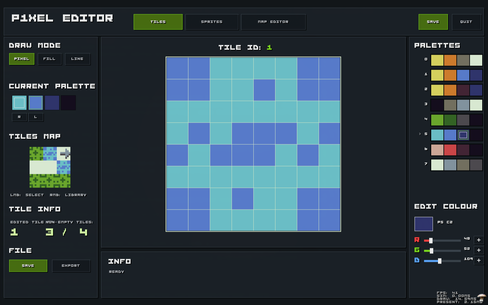
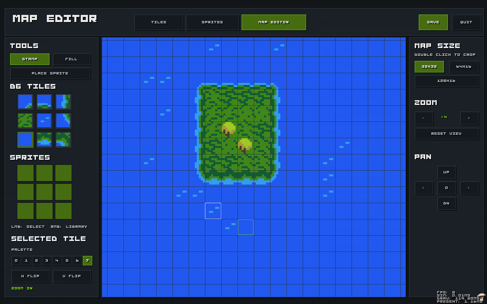

# P1Xel Editor

**P1Xel Editor** is a small pixel-art, tile, sprite, palette, and map editor built with Zig on top of the **Borowik Engine** by Krzysztof Krystian Jankowski.

It is designed around a classic indexed-colour workflow: artwork is stored as tiny 8×8 images whose pixels are palette indices, not direct RGB values. Changing a palette updates every tile/sprite that uses that palette, making it easy to build Game Boy Color-style tilesets, sprite sheets, and maps.





## Features

- 8×8 tile editor with pixel, fill, and line tools.
- Separate **Tiles** and **Sprites** banks.
- Indexed-colour editing with 4 biome palette banks.
- Each biome palette bank contains 8 palettes with 4 colours each.
- Per-tile palette assignment within the active biome palette bank.
- Tile/sprite library with add, duplicate, delete, paging, and visible-slot selection.
- Map editor with 4 independent map banks, background tile stamping, fill, sprite placement, palette overrides, flips, zoom, pan, and map resizing.
- Persistent project storage in `art_data.p1x`.
- Built-in default project data with a shared base tileset and imported biome palette sets.

## Project limits

The current editor constants are defined in `src/engine/config.zig`:

| Item | Value |
| --- | ---: |
| Tile size | `8×8` pixels |
| Colours per palette | `4` |
| Palettes per biome bank | `8` |
| Palette banks / biome banks | `4` |
| Map banks | `4` |
| Max images per bank | `128` |
| Image banks | Tiles + Sprites |
| Default project file | `art_data.p1x` |
| Map sizes | `32×32`, `64×16`, `128×16` |
| Window size | `1440×900` |

## Indexed editing model

P1Xel Editor does **indexed editing**. Each pixel inside a tile/sprite stores a small number from `0` to `3`, which points to one of the four colours in the selected palette.

That means an image is made of:

1. A `palette_id` from `0` to `7`.
2. A grid of 64 pixel indices, each from `0` to `3`.

For example:

```text
Tile pixel value: 2
Tile palette:     palette 4
Displayed colour: palette 4, colour slot 2
```

This is different from direct RGB painting. If you change palette 4 colour slot 2, every tile using palette 4 and index 2 visually changes, without rewriting tile pixels.

### Why indexed colour?

Indexed colour is useful for retro/game-art workflows because it lets you:

- Reuse the same tile art with different palettes.
- Change a whole scene’s mood by editing palette colours.
- Keep art compatible with constrained hardware-style formats.
- Separate shape/detail editing from colour-theme editing.

## Palettes and biome banks

The editor supports **4 palette banks** intended as biome banks. Each bank contains **8 palettes**, and each palette contains **4 colour slots**.

The important idea is that the **tileset is shared**, but the palette bank can change. This lets the game reuse the same tile IDs and pixel-index data while swapping the active biome palette before loading a different map/sprite set.

Current default setup:

| Bank | Purpose |
| ---: | --- |
| `1` | Grassland palette set. |
| `2` | Desert palette set imported from `docs/desert_tileset.png`. |
| `3` | Extra grassland-style palette bank, available for another biome/variant. |
| `4` | Extra desert-style palette bank, available for another biome/variant. |

In the tile/sprite editor, the right panel contains:

- **Palette Bank** — switch between the four biome palette sets.
- **Palettes** — the active bank’s 8 palettes and their four colour slots.
- **Edit Colour** — RGB sliders for the currently selected palette colour.

### Selecting palette colours

In the **Current Palette** panel:

- **Left mouse button** selects the left/primary draw colour.
- **Right mouse button** selects the right/secondary draw colour.

The active left/right colours are shown with `L`, `R`, or `LR` markers.

### Editing RGB values

In **Edit Colour**, choose a palette colour and then adjust its RGB channels. Because the artwork is indexed, changing a palette colour updates all visible pixels that reference that palette slot in the **active palette bank**.

Palette changes are bank-local. Editing bank `2`, palette `3`, colour `1` does not change bank `1`, palette `3`, colour `1`.

### Transparency in sprite mode

Sprite mode treats colour index `0` as transparent. This is why the first colour slot behaves differently for sprites than for background tiles.

Tiles do not use transparency in the same way; all four colour indices can be visible.

## Main editor screens

The top navigation has three main sections:

- **TILES** — edit background tiles.
- **SPRITES** — edit sprite images.
- **MAP EDITOR** — place tiles and sprites onto a map.

The editor also has a tile/sprite library screen used for selecting, swapping, adding, duplicating, and deleting images.

## Tiles and Sprites editor

The **TILES** and **SPRITES** screens share the same editor layout.

### Top bar

- **TILES** — switch to tile bank.
- **SPRITES** — switch to sprite bank.
- **MAP EDITOR** — open the map editor.
- **SAVE** — save the current project to `art_data.p1x`.
- **QUIT** — exit the application.

### Left panel

#### Draw Mode

Tools:

| Tool | Description |
| --- | --- |
| `PIXEL` | Paint individual pixels. |
| `FILL` | Flood-fill a connected region. |
| `LINE` | Click one point, then another point to draw a line. |

#### Current Palette

Shows the four colour slots of the selected tile/sprite palette.

- LMB selects the primary colour.
- RMB selects the secondary colour.

#### Tiles Map

Shows the nine visible quick-access slots for the current bank.

- `LMB: SELECT` — select a tile/sprite from the visible slots.
- `RMB: LIBRARY` — open the library to swap that slot.

#### Tile Info

Shows:

- Current edited image ID.
- Count of non-empty images in the current bank.

#### File

- `SAVE` writes `art_data.p1x`.
- `EXPORT` is currently present as a UI action, but export is not implemented yet.

### Centre panel

The centre panel is the large pixel canvas for the selected 8×8 image.

Painting behaviour:

- LMB paints with the selected left colour.
- RMB paints with the selected right colour.
- Fill and line use whichever mouse button/colour starts the action.

### Right panel

The right panel controls palettes and colour editing:

- Select a palette and colour slot.
- Edit the RGB values of that colour slot.
- Changing palette colours updates all indexed art using those palette slots.

## Tile/Sprite Library

The library is opened from the tile/sprite slot preview with RMB, or from workflows that request choosing/swapping a visible slot.

Library actions:

| Action | Description |
| --- | --- |
| `< BACK` | Return to the previous editor screen. |
| `+ ADD` | Create a new blank image in the current bank. |
| `DUPLICATE` | Copy the currently selected image into a new slot. |
| `DELETE` / `CONFIRM` | Delete the selected image after confirmation. |
| `<` / `>` | Change library page. |

The grid displays up to `16×8` images per page. Image IDs are shown in hexadecimal-style row/column layout.

## Map Editor

The map editor lets you build maps from the shared tileset base and place sprite instances on top.

There are **4 map banks**. Switching map bank also switches to the matching palette bank, so each biome map has its own dedicated palette set while still using the same shared tile IDs.

| Map bank | Automatically uses palette bank |
| ---: | ---: |
| `1` | `1` |
| `2` | `2` |
| `3` | `3` |
| `4` | `4` |

### Top bar

- **TILES** — return to tile editing.
- **SPRITES** — switch to sprite mode and return to the editor.
- **MAP EDITOR** — current active screen.
- **SAVE** — save project data.
- **QUIT** — exit.

### Left panel

#### Tools

| Tool | Description |
| --- | --- |
| `STAMP` | Stamp the selected background tile. |
| `FILL` | Fill connected map cells with the selected background tile. |
| `PLACE SPRITE` | Add or update a sprite instance at a map cell. |

#### BG Tiles and Sprites selectors

Both selectors show nine quick-access slots.

- `LMB: SELECT` — select the tile/sprite for placement.
- `RMB: LIBRARY` — open the library to swap that visible slot.

#### Selected Tile attributes

The map editor has temporary placement attributes:

- Palette override.
- Horizontal flip.
- Vertical flip.

These affect the **next tile/sprite placed**. They do not recolour or alter the last stamped item simply because you changed the controls.

For background tiles, the palette/flip data is stored per map cell.
For sprites, the palette/flip data is stored per placed sprite instance.

### Canvas

The centre canvas displays the map.

Map canvas controls:

- LMB draws/places using the selected map tool.
- RMB picks a background map cell and its attributes.

The canvas header displays the current map size.

### Right panel

#### Map Bank

Selects one of four maps. Map bank `1` uses palette bank `1`, map bank `2` uses palette bank `2`, and so on.

This mirrors the intended game workflow: switch palette bank, then load/use the matching map bank.

#### Map Size

Available sizes:

- `32×32`
- `64×16`
- `128×16`

The UI notes “double click to crop” because changing to a smaller size may remove map data outside the new bounds.

#### Zoom

- `-` zooms out.
- `+` zooms in.
- `RESET VIEW` resets zoom and pan.

#### Pan

Directional buttons pan the map viewport.

## Persistence

The project is saved to:

```text
art_data.p1x
```

The project file stores:

- Four biome palette banks.
- Active palette bank and active map bank.
- Tile bank state and images.
- Sprite bank state and images.
- Visible quick-access slots.
- Current selections.
- Four map banks with independent dimensions.
- Background tile IDs and per-cell attributes for each map bank.
- Placed sprite instances and their attributes for each map bank.

If `art_data.p1x` does not exist or cannot be loaded, the editor starts from its built-in default project data. The current default tile bank contains the embedded grassland base tiles plus tiles imported from `docs/desert_tileset.png`.

### Project format migration

The current project format supports four palette banks and four map banks. Older project files are migrated on load:

- Existing tile/sprite data is preserved.
- Existing map data is loaded into map bank `1`.
- Desert biome tiles are appended to the shared tile base when needed.
- Saving writes the new project format back to `art_data.p1x`.

## Source images and docs assets

The repository includes example/reference art in `docs/`:

- `docs/desert_tileset.png` — source image for the imported desert biome tiles/palette bank.
- `docs/design.png`
- `docs/screenshot-tiles.png`
- `docs/screenshot-map.png`

These are useful as visual references and for testing palette/tile workflows. The built-in grassland data and imported desert data are stored as internal indexed tiles and extracted palettes in `src/editor/project.zig`.

The default internal tile base is therefore a combined tileset:

```text
[ embedded grassland tiles ][ imported desert tiles ]
```

All four map banks reference this one shared tile base.

## Building

Requirements:

- Zig installed.
- On Linux: X11 and ALSA development libraries available.
- On Windows: GDI and WinMM are linked by the build script.

Build:

```sh
zig build
```

Run:

```sh
zig build run
```

Release build helpers:

```sh
zig build release-linux
zig build release-windows
```

The release steps use `upx`, so install UPX first if you want those targets to complete.

## Engine

P1Xel Editor runs on the **Borowik Engine**.

Engine info:

- Author: Krzysztof Krystian Jankowski
- Repository: <https://github.com/w84death/borowik-engine>
- Current configured version: `2.2`

At startup, the engine prints an init welcome message including the engine name, author, and version.

## Code structure

Important files:

| File | Purpose |
| --- | --- |
| `src/main.zig` | Application entry point, state loop, splash/global overlay. |
| `src/editor/project.zig` | Project data model, palettes, images, map, load/save. |
| `src/editor/main_editor.zig` | Tile/sprite pixel editor UI and tools. |
| `src/editor/map_editor.zig` | Map editor UI, placement tools, map rendering. |
| `src/editor/tile_library.zig` | Tile/sprite library screen. |
| `src/editor/views.zig` | Shared drawing helpers for tiles/images. |
| `src/engine/render.zig` | Framebuffers, drawing primitives, presentation. |
| `src/engine/config.zig` | Editor/engine constants. |

## Workflow tips

1. Start in **TILES** and draw or refine reusable 8×8 background tiles.
2. Use **Palette Bank** in the tile editor to preview/edit a biome palette set.
3. Use palette banks for biome swaps: the same shared tileset can be displayed with different palette sets.
4. Switch to **SPRITES** for transparent sprite artwork. Remember colour index `0` is transparent in sprite mode.
5. Use the visible nine-slot tile map for quick access. RMB on a slot opens the library to swap it.
6. Open **MAP EDITOR** to stamp tiles, fill regions, and place sprites.
7. Switch map banks to edit each biome map; the matching palette bank is selected automatically.
8. In-game, mirror this workflow by selecting the palette bank before loading/rendering the related map/sprites.
9. Save regularly; the editor writes to `art_data.p1x`.

## Current limitations

- Export UI exists, but export is not implemented yet.
- Art is constrained to 8×8 indexed images.
- Each image can reference one 4-colour palette ID; the displayed colours come from the active palette bank.
- The built-in map size presets are fixed.
